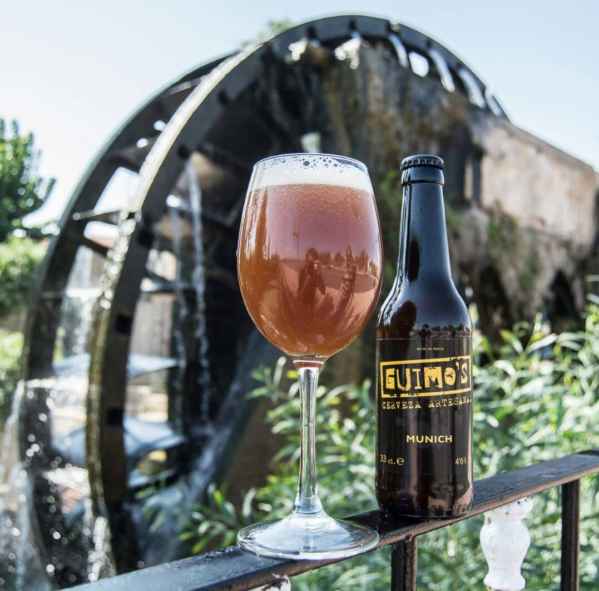
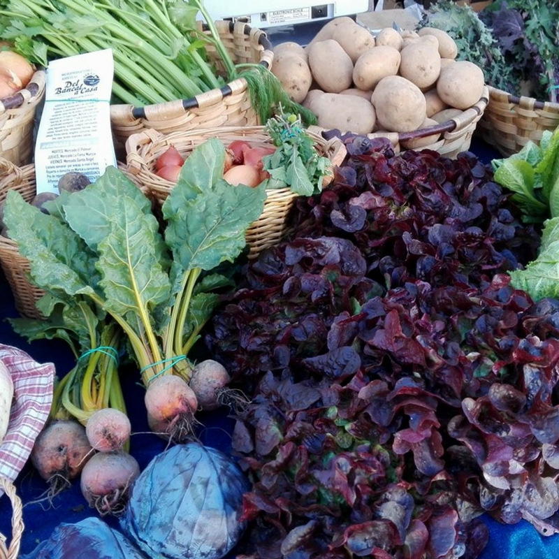

<!-- Si separas esto 
    <section>
	<header class="major">
		<h2>Erat lacinia</h2>
	</header>
	

		<article>
			
			

				<h3>Portitor ullamcorper</h3>
				
Aenean ornare velit lacus, ac varius enim lorem ullamcorper dolore. Proin aliquam facilisis ante interdum. Sed nulla amet lorem feugiat tempus aliquam.

			

		</article>
		<article>
			
			

				<h3>Sapien veroeros</h3>
				
Aenean ornare velit lacus, ac varius enim lorem ullamcorper dolore. Proin aliquam facilisis ante interdum. Sed nulla amet lorem feugiat tempus aliquam.

			

		</article>
		<article>
			
			

				<h3>Quam lorem ipsum</h3>
				
Aenean ornare velit lacus, ac varius enim lorem ullamcorper dolore. Proin aliquam facilisis ante interdum. Sed nulla amet lorem feugiat tempus aliquam.

			

		</article>
		<article>
			
			

				<h3>Sed magna finibus</h3>
				
Aenean ornare velit lacus, ac varius enim lorem ullamcorper dolore. Proin aliquam facilisis ante interdum. Sed nulla amet lorem feugiat tempus aliquam.

			

		</article>
	

</section>

de esto no se vera el material -->

<!-- Comentarios para borrar codigo -->
<section>
	<header class="major">
		<h2>Recientes</h2>
	</header>
	

		<article>
			
			<h3>Murcia Entiende Así</h3>
			
El día 13 de mayo darán comienzo las distintas actividades que engloba la edición 2017 de “Murcia Entiende Así”, entre las que cabe destacar la XII Muestra de Cine LGTBI en la Filmoteca Regional y el Desfile del Orgullo LGTBI 2017.

		</article>
		<article>
			
			<h3>Rojinegro es un sentimiento</h3>
			
Para entender la historia del Club de Accionariado Popular Ciudad de Murcia, debemos remontarnos al 1999, año en el Quique Pina funda el Club de Fútbol Ciudad de Murcia S.A.D, un equipo que rápidamente sube a Segunda B y posteriormente asciende a Segunda División, donde se mantuvo durante cuatro temporadas.

			<ul class="actions">
				<li><a href="#" class="button">Más</a></li>
			</ul>
		</article>
		<article>
			
			<h3>Cervezas Guimo's</h3>
			
Malta, lúpulo, levadura y agua es todo lo que necesita una buena cerveza para deleitar nuestro paladar. Estos son los ingredientes que podemos encontrar en la Guimo’s, la única marca de cerveza artesana que se produce en el municipio de Murcia.

			<ul class="actions">
				<li><a href="#" class="button">Más</a></li>
			</ul>
		</article>
		<article>
			
			<h3>Verduras felices</h3>
			
Alfonso y Paco son Del Bancal a Casa, un proyecto la mar de bonico sobre agricultura ecológica nacido en la pedanía murciana de El Esparragal que comenzó hace algo más de tres años, y que desde entonces, se encarga de reflotar huertos abandonados para convertirlos en terrenos cultivables y ecológicos.

			<ul class="actions">
				<li><a href="#" class="button">Más</a></li>
			</ul>
		</article>
		<article>
			
			<h3>Moda ética a ritmo de punk</h3>
			
Alexandra Cánovas y Martaé Martínez son Las CulpaSS. Dos diseñadoras murcianas que, cansadas del discurso habitual que encontraban en el mundo de la moda, decidieron crear su propia marca de ropa y complementos para mujeres y hombres reales alejadas de los eslóganes dañinos de la industria consumista.

			<ul class="actions">
				<li><a href="#" class="button">Más</a></li>
			</ul>
		</article>
		<article>
			
			<h3>Mucho más que negror</h3>
			
Manuel Romero más conocido como L.Warlock, es un artista multidisciplinar de la escena Hip Hop murciana que además de su trayectoria como pinchadiscos, cineasta, locutor y amante y conocedor del negreo en su máximo esplendor; recientemente también nos ha sorprendido estrenándose como productor. Todo un genio y figura del underground murciano al que no podíamos dejar de hacerle un hueco en este, nuestro Encuentro Divergente.

			<ul class="actions">
				<li><a href="#" class="button">Más</a></li>
			</ul>
		</article>
	

</section>
